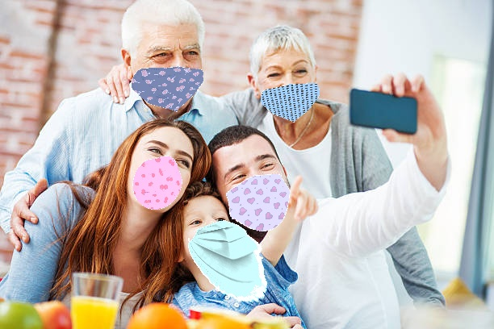
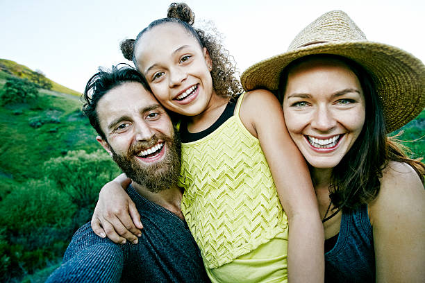
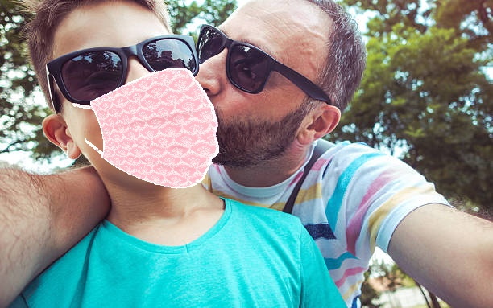

[Artificial Neural Networks and Deep Learning course](http://chrome.ws.dei.polimi.it/index.php?title=Artificial_Neural_Networks_and_Deep_Learning).
=
- Academic year 2020-2021
- 1st semester of 2st year
- [Politecnico di Milano](https://www.polimi.it/)

________________________
 Group member:
 -
> - Saeid Rezaei
> - Abdolvakil Fazli
> - Tina Emami

________________________

# Image Classification
________________________
## Problem description
________________________
In this project, we are required to classify images depicting groups of people based on the number of masked people. In the specific, the solution must discriminate between images depending on the following cases: 1) All the people in the image are wearing a mask, 2) No person in the image is wearing a mask, 3) Someone in the image is not wearing a mask. In the following 3 examples of image from the training belonging to the three cases.
 <p float="left">
  
   
  
</p>

Thus, the classification is performed on 3 different classes. Being a classification problem, given an image, the goal is to predict the correct class label. The dataset details can be found at [this link](https://drive.google.com/file/d/1yNtUs8cSyqo_WGGEWdIdCZB7SL4ausdD/view?usp=sharing). The zipped file contains 2 folders containing training and test images and a josn file. The structure of the zipped file is as following: 

```
- training folder/
      - img1, img2, ... , imgN
- test folder/
       - img1, img2, ... , imgN
- json file/
       - {Image_Name:Label}
```

## Data Description
________________________
### Dataset Details

* Image size: variable
* Color space: RGB/Grayscale (read as 'rgb' in ImageDataGenerator.flow_from_directory ('color_mode' attribute) or use PIL.Image.open('imgname.jpg').convert('RGB'))
* File Format: JPG
* Number of classes: 3
* Classes:

 &nbsp; &nbsp; &nbsp; 0: "NO PERSON in the image is wearing a mask"
 
  &nbsp; &nbsp; &nbsp; 1: "ALL THE PEOPLE in the image are wearing a mask"
  
 &nbsp; &nbsp; &nbsp; 2: "SOMEONE in the image is not wearing a mask"

### Dataset Structure
Two folders:
   * training: 5614 images
   * test: 450 images
   
Training images per class:

&nbsp; &nbsp; &nbsp; 0 : 1900

&nbsp; &nbsp; &nbsp; 1 : 1897
 
&nbsp; &nbsp; &nbsp; 2 : 1817

train_gt.json: Labels for images are provided in the *train_gt.json" file.

________________________


