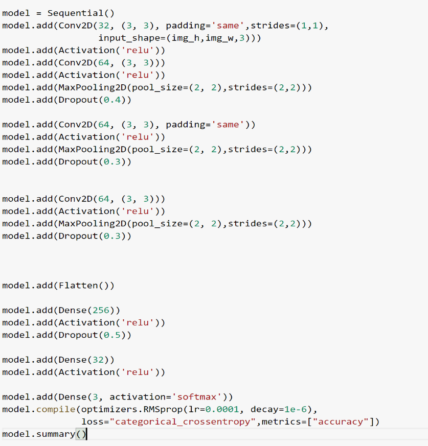
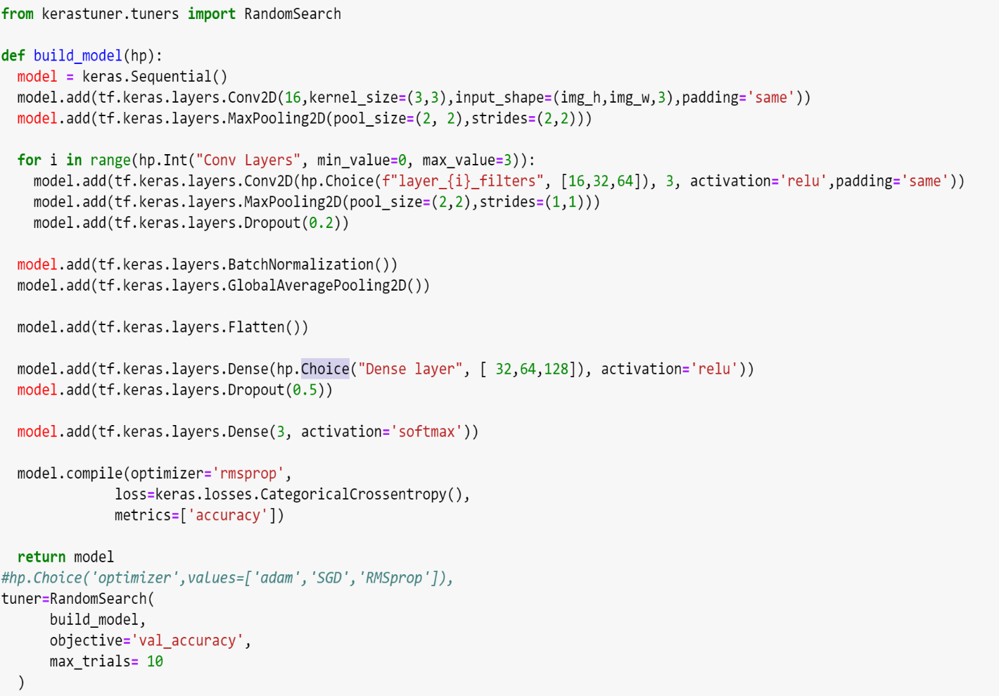
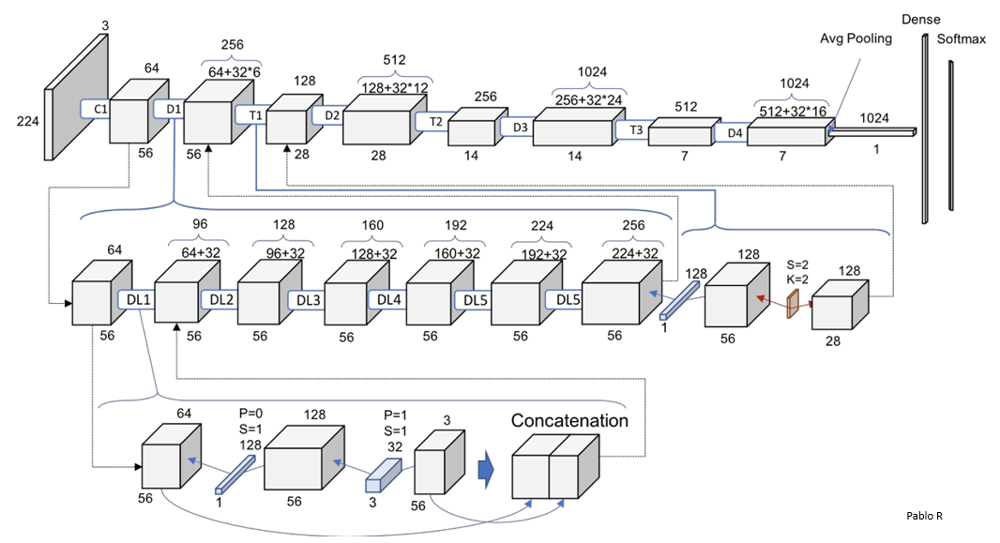

# Image Classification project
________________________
### [Artificial Neural Networks and Deep Learning course](http://chrome.ws.dei.polimi.it/index.php?title=Artificial_Neural_Networks_and_Deep_Learning)
- Academic year 2020-2021
- 1st semester of 2nd year
- [Politecnico di Milano](https://www.polimi.it/)

________________________
 Group members:
 -
 - Saeid Rezaei
 - Abdolvakil Fazli


________________________
## Problem description

In this project, we are required to classify images depicting groups of people based on the number of masked people. In the specific, the solution must discriminate between images depending on the following cases: 1) All the people in the image are wearing a mask, 2) No person in the image is wearing a mask, 3) Someone in the image is not wearing a mask. In the following 3 examples of image from the training belonging to the three cases.
 <p float="left">
  
   
  
</p>

Thus, the classification is performed on 3 different classes. Being a classification problem, given an image, the goal is to predict the correct class label. The dataset details can be found at [this link](https://drive.google.com/file/d/1yNtUs8cSyqo_WGGEWdIdCZB7SL4ausdD/view?usp=sharing). The zipped file contains 2 folders containing training and test images and a josn file. The structure of the zipped file is as following: 

```
- training folder/
      - img1, img2, ... , imgN
- test folder/
       - img1, img2, ... , imgN
- json file/
       - {Image_Name:Label}
```
________________________
## Data Description

### Dataset Details

* Image size: variable
* Color space: RGB/Grayscale (read as 'rgb' in ImageDataGenerator.flow_from_directory ('color_mode' attribute) or use PIL.Image.open('imgname.jpg').convert('RGB'))
* File Format: JPG
* Number of classes: 3
* Classes:

 &nbsp; &nbsp; &nbsp; 0: "NO PERSON in the image is wearing a mask"
 
  &nbsp; &nbsp; &nbsp; 1: "ALL THE PEOPLE in the image are wearing a mask"
  
 &nbsp; &nbsp; &nbsp; 2: "SOMEONE in the image is not wearing a mask"

### Dataset Structure
Two folders:
   * training: 5614 images
   * test: 450 images
   
Training images per class:

&nbsp; &nbsp; &nbsp; 0 : 1900

&nbsp; &nbsp; &nbsp; 1 : 1897
 
&nbsp; &nbsp; &nbsp; 2 : 1817

train_gt.json: Labels for images are provided in the *train_gt.json" file.

________________________

## DATA PREPARATION

In this part we should make sure that the training, validation, and the test dataset are set-up in a manner that is usable for the task as well as boosting the overall performance of the deep learning model. 
We loaded all data in as a Pandas data-frame and thanks to the `data_gen.flow_from_dataframe()` function, we were easily able to make the desired data generator which links the json file to the corresponding folder. We also use `ImageDataGenerator` not only for making more training images, but also to reduce the probability of overfitting by adding more training data.

Some Important points:
*	Input data should be augmented using ImageDataGenerator. By doing this we have more training version of train_data making our prediction more robust to the new test data.
*	 Validation and test data are not augmented.
*	Shuffling the data at the beginning is a crucial task to be done. 
*	setting a specific SEED for the training to be reproducible. 

________________________

## ARCHITECTURES

The simplest way to tackle this task is to use the CNN and simply by playing with parameters like Learning_Rate, Depth of each layer, number of units, padding, and strides, etc. 
This seems comfortable at first, but it become very overwhelming and tricky as the degree of freedom becomes a lot.

One solution for that is parameter tuning. You can see the example here that the hyperparameter tuner we can select the best model on a gird of possible values for parameters using random search.

### CNN ARCHITECTURE:
The simple model is as follows:
 <p float="left">
  
</p>
 This model gives us a 0.67 accuracy on validation set which is not acceptable. So we use Hyperparameter Tuning in order to improve accuracy. 
 
We can tune the hyperparameters using a grid of parameters. This was discussed before we put a section for it just to stress on the importance of this method on choosing the best_model. You can check [this File](Source-Code/HyperparamterTuning.ipynb) for that. 
The Hyperparameter Tuining is shown as follows.
 <p float="left">
  
</p>

Even with this, the performance is not that good. So, because our input data is small we can resort to transfer learning. There are some other ways to improve the accuracy like changing the parameters, adding the depth of convolutional segment, adding more convolutonal layer, using `BatchNormalization()` and `GlobalAveragePooling2D()` functions and so on, but here we decide to use [Transfer Learning](https://machinelearningmastery.com/transfer-learning-for-deep-learning/)
Two ways for transfer learning:
- We first incorporate a base model on a set of predicted weights to it, and then all layers (or some of them) are freezed. After that we create a new model on top of the output of the previous one and train the new model on the new dataset. 
- Alternatively, instead of freezing the layers of the base model we can run a new dataset through it record the output of one (or several) layers from base model (feature extration). Then we can use the output as an input for the new and smaller dataset.

The best result obtained is using both approaches and the latter worked better than the former for us, with scores 0.951 and 0.788 respectively. 

### Creating the base Model
Thanks to the keras.applications, there are some pre-trained transfer learning models for image classification that help us to solve the problem. VGG16 was the first based model which we used it, this model is one of the most popular pre-trained models (but not efficient) for image classification but unfortunately the results were not as good as we expected. So after studying some articles we finally decided to use the [DenseNet121](https://towardsdatascience.com/understanding-and-visualizing-densenets-7f688092391a). DenseNet is a convolutional neural network where each layer is connected to all other layers that are deeper in the network, that is, the first layer is connected to the 2nd, 3rd, 4th and so on, the second layer is connected to the 3rd, 4th, 5th and so on.
 <p float="left">
  
</p>
________________________

## Training

To train this model, the Adam Optimizer is used to minimize the loss function with initial learning rate 1e-4, but thanks to the `ReduceLROnPlateau` it can be improved during the training phase with patience=10. We also used `EarlyStopping` to prevent overfitting, `ModelcheckPoint` to save the weights, and `TensorBoard` to visualize the accuracy and lost results.
In addition, we will use the model.fit () function to train our model. Here the most important parameter that must be carefully selected is number of epochs. For our project this parameter is up to 25.
________________________


