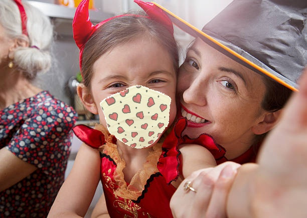
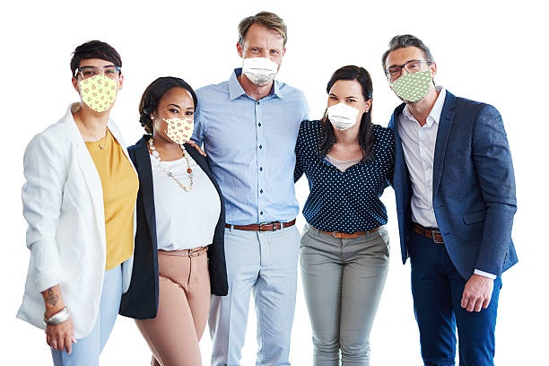

[Artificial Neural Networks and Deep Learning course](http://chrome.ws.dei.polimi.it/index.php?title=Artificial_Neural_Networks_and_Deep_Learning).
=
- Academic year 2020-2021
- 1st semester of 2st year
- [Politecnico di Milano](https://www.polimi.it/)

________________________
 Group member:
 -
> - Saeid Rezaei
> - Abdolvakil Fazli
> - Tina Emami

________________________

# Image Classification

## Problem description
In this project, we are required to classify images depicting groups of people based on the number of masked people. In the specific, the solution must discriminate between images depending on the following cases: 1) All the people in the image are wearing a mask, 2) No person in the image is wearing a mask, 3) Someone in the image is not wearing a mask. In the following 3 examples of image from the training belonging to the three cases.
 

 
  

  
   

 
  

  
   

 
  

