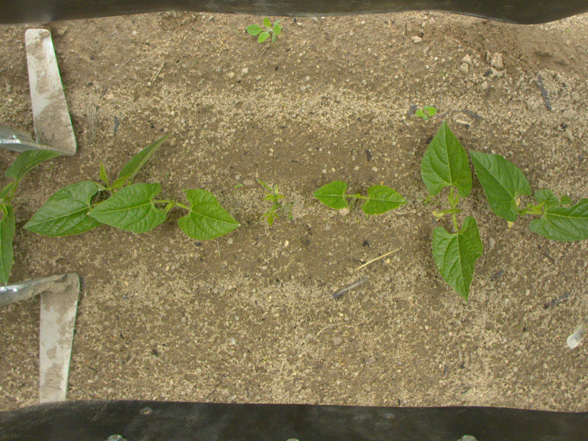
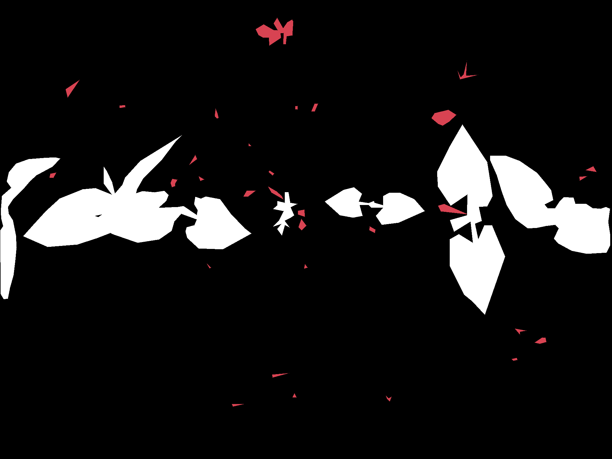
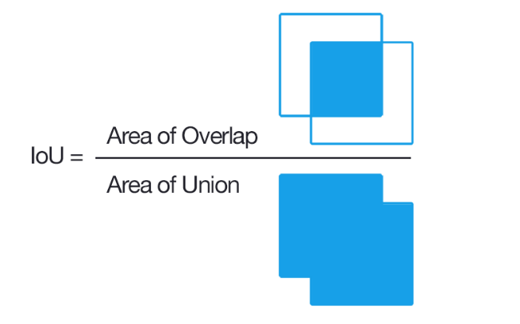

# Image Segmentation project
________________________
### [Artificial Neural Networks and Deep Learning course](http://chrome.ws.dei.polimi.it/index.php?title=Artificial_Neural_Networks_and_Deep_Learning)
- Academic year 2020-2021
- 1st semester of 2nd year
- [Politecnico di Milano](https://www.polimi.it/)

________________________
 Group members:
 -
 - Saeid Rezaei
 - Abdolvakil Fazli


________________________
## Problem description
In this assignment the task of multiclass semantic segmentation for Bipbip dataset drawn from the first round of [ACRE Cascade Competition](https://competitions.codalab.org/competitions/27176) is being studied. ACRE is the Agri-food Competition for Robot Evaluation, part of the METRICS project funded by the European Union’s Horizon 2020 research and innovation program under grant agreement No 871252. Autonomous robots compete to demonstrate their ability to perform agricultural tasks (such as removing weeds or surveying crops down to individual-plant resolution).  The same network, maybe with a little bit of different parameters or fine tunings, can be used for other type of the datasets (PEAD, ROSEAU, WeedElec) in the competition.

________________________
## Data description

### Dataset Details
Basically, we are given some images of different classes, and different kinds, and the task is to write a segmentation algorithm such that a robot can perform accurate separation from weed/crop classification. The dataset is composed of images captured by different sensors in different moments and are about two kinds of crops: haricot and maize. Images in the dataset are divided into different folders based on the team that acquired the image, i.e., Bipbip, Pead, Roseau, Weedelec. For each team, we have two different sub-folders named as the type of crop present in the images, i.e., Haricot and Mais. Finally, for each crop, we provide the captured RGB images, in the Images folder, and the corresponding ground-truth segmentations, in the Masks folder. A aptured RGB image and its corresponding ground-truth is shown as following:
 <p float="left">
  
   
</p>

### Dataset structure
The dataset zipped file contains 2 folders containing training and test images. The structure of the zipped file is as following: 

```
- training/

    -Bipbib
       -Haricot
           -Images
              - img1, img2, ... , imgN
           -Masks
              - img1, img2, ... , imgN
       -Mais
           -Images
               - img1, img2, ... , imgN
           -Masks
               - img1, img2, ... , imgN
               
    -Pead
       -Haricot
           -Images
               - img1, img2, ... , imgN
           -Masks
               - img1, img2, ... , imgN
       -Mais
           -Images
               - img1, img2, ... , imgN
           -Masks
               - img1, img2, ... , imgN
               
    -Roseau
       -Haricot
           -Images
               - img1, img2, ... , imgN
           -Masks
               - img1, img2, ... , imgN
       -Mais
           -Images
               - img1, img2, ... , imgN
           -Masks
               - img1, img2, ... , imgN
               
    -Weedelec
       -Haricot
           -Images
               - img1, img2, ... , imgN
           -Masks
               - img1, img2, ... , imgN
       -Mais
           -Images
               - img1, img2, ... , imgN
           -Masks
               - img1, img2, ... , imgN
    
- test_Dev/

    -Bipbib
       -Haricot
           -Images
              - img1, img2, ... , imgN
       -Mais
           -Images
               - img1, img2, ... , imgN
               
    -Pead
       -Haricot
           -Images
               - img1, img2, ... , imgN
       -Mais
           -Images
               - img1, img2, ... , imgN
               
    -Roseau
       -Haricot
           -Images
               - img1, img2, ... , imgN
       -Mais
           -Images
               - img1, img2, ... , imgN
               
    -Weedelec
       -Haricot
           -Images
               - img1, img2, ... , imgN
       -Mais
           -Images
               - img1, img2, ... , imgN

```
________________________

## Data preparation
As a supervised learning task, we are also given with the mask images for those training images. This help us to adopt a deep learning approach, splitting the target and input, thanks to the customdataset() function letting us to return a tuple of augmented and preprocessed images and masks and model.fit() in Keras which eases the separation between target and the input for every image.
The customdataset() function needs a lot of things to be cared of one of which is going through different directories to get the right images and shuffling them through augmentation.
The difference and challenging problem here, especially in visualization and preprocessing is that unlike image classification, here the targets are images as well. This is also challenging when it comes to the deep neural network approach which leads us to apply Encoder-Decoder structure. While the former takes care of capturing the context (answering to the “what?”) and the latter is going to precise localization (answering to “where?”).  In U-net they are respectively called contraction and expansion. 

________________________

## Architecture
A [U-Net architecture](https://en.wikipedia.org/wiki/U-Net#:~:text=The%20U-Net%20architecture%20stems%20from%20the%20so-called%20%E2%80%9Cfully,these%20layers%20increase%20the%20resolution%20of%20the%20output.) "fully convolutional network" is used to combine low-level feature maps with higher-level ones, which enables precise pixel-level localization.
 <p float="left">
  
</p>
In this assignment we used different approaches: vgg-unet, Resnet34, and also we fine tuned the vgg-unet to be able to precisely answer to question of what as the dataset is very small but there were always the fear of falling into the trap of overfitting. They are easy to be fined in the notebook attached to this report
But the best approach was a simple use of U-Net-like approach given by Keras documentation which gave us a maximum mean IoU of 0.47. 

________________________

## Evaluation
Submissions are evaluated on the mean Intersection over Union (IoU) obtained on the two classes, crop and weed. IoU is typically used in segmentation tasks and it essentially quantifies the percentage of overlap between predicted and target segmentations (see image below).
 <p float="left">
  
</p>
IoU is computed for each target class (crop and weed) separately, by considering prediction and ground truth as binary masks. Then, the final IoU is computed by averaging the two.  Thus, we have the following formulation:

```
IoU(crop) = TP(crop) / (TP(crop) + FP(crop) + FN(crop))
IoU(weed) = TP(weed) / (TP(weed) + FP(weed) + FN(weed))
IoU = (IoU(crop) + IoU(weed)) / 2
```
